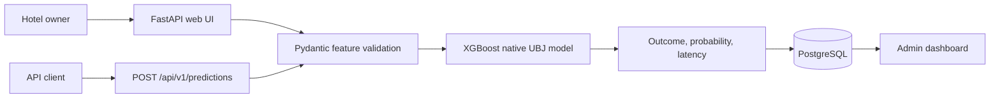
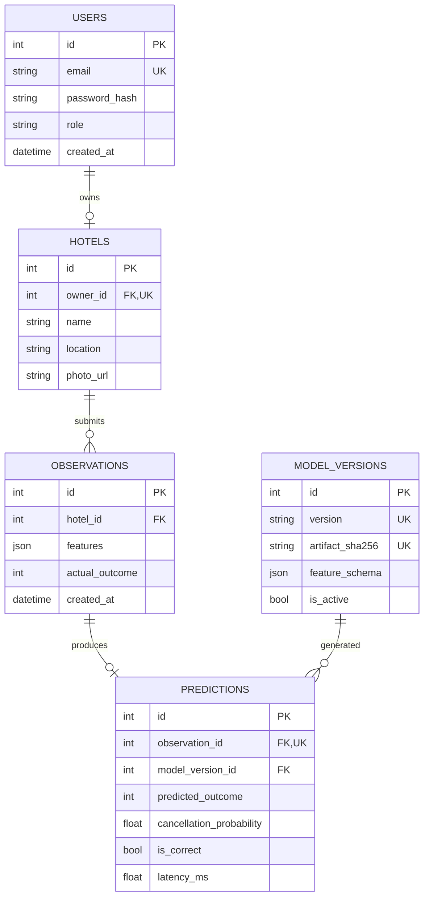

# Hotel Cancellation Prediction Service

A production-oriented XGBoost inference service for hotel booking cancellation risk. It combines a validated FastAPI/web interface, versioned model artifacts, PostgreSQL prediction lineage, schema migrations, container configuration, observability, and integration tests. The original analysis notebook remains in `work.ipynb`.

## System architecture



The service loads the model once at startup, verifies the feature schema, records the artifact SHA-256 as a model version, and links every prediction to both its input observation and model version.

## Why PostgreSQL

MongoDB previously stored users, nested hotel records, observations, predictions, and the complete pickled model binary. Those entities have strong relationships, uniqueness rules, transactional writes, and cascade behavior. PostgreSQL is a better fit because foreign keys can guarantee lineage and a single transaction can store an observation and its prediction consistently. Model bytes now remain an immutable file; PostgreSQL stores the version, checksum, path, and feature schema.

## Data model



The initial Alembic migration defines unique email and artifact constraints, binary outcome checks, foreign keys, cascade deletion, and access-path indexes.

## Model lifecycle

The notebook compared logistic regression, KNN, decision tree, random forest, XGBoost, and SVM. Its saved output reports XGBoost test accuracy of `0.8920`; that historical notebook metric was not rerun during this engineering pass.

The original `model_xgb.pkl` is retained for provenance. `scripts/migrate_model_artifact.py` converted it to XGBoost's stable native UBJ format and wrote an explicit feature manifest. The active artifact is:

- version: `xgb-12fafa9cc47d`
- SHA-256: `12fafa9cc47d666c9d89e0773e905e2fe6dc4a8841251ca5e6057bb27160ed22`
- features: 14

One verified representative input produced `Not Cancelled` with cancellation probability `0.0516307`. The service measures each model call; this is not a latency benchmark.

### Reproducible retraining

```bash
python -m backend.training --input cellula_hotel.csv --output artifacts --seed 42 --estimators 150
MODEL_PATH=artifacts/model_xgb.ubj uvicorn backend.main:app
```

The CSV pipeline strips headers, validates all 14 features against the serving schema,
checks booking IDs and targets, and reports rejected/duplicate records. Category mappings
are explicit: meals 0..3, markets 0..4, rooms use their numeric suffix **1..7**, matching
the original notebook rather than the incorrect zero-based UI. Rare but valid bookings
are retained instead of blanket IQR filtering. A stratified 70/15/15 split isolates the
test set, with a prior-probability baseline and fixed-seed XGBoost comparison.

The real local run accepted all 36,285 rows: 25,399 training, 5,443 validation, 5,443 test.
Validation accuracy was 0.87268 versus the baseline's 0.67242; held-out test accuracy
was 0.86478 and ROC AUC 0.92462. Full results and source checksum are in
`docs/evaluation.json`. These are a new split/run, not an improvement claim over the
old notebook's differently filtered data. Retrained artifacts stay ignored; the legacy
native artifact remains the default to preserve behavior.

## API

- `GET /health` checks database reachability and model readiness.
- `POST /api/v1/predictions` validates a structured request and requires an authenticated session.
- `/docs` exposes generated OpenAPI documentation.

Example request after login:

```json
{
  "features": {
    "number_of_adults": 1,
    "number_of_children": 1,
    "number_of_weekend_nights": 2,
    "number_of_week_nights": 5,
    "type_of_meal": 0,
    "car_parking_space": 0,
    "room_type": 1,
    "lead_time": 224,
    "market_segment_type": 0,
    "repeated": 0,
    "previous_cancellations": 0,
    "previous_not_cancelled": 0,
    "average_price": 88,
    "special_requests": 0
  },
  "actual_outcome": 0
}
```

Responses include the prediction id, class, probability, correctness when known, model version, and model-call latency.

## Run with Docker Compose

```bash
cp .env.example .env
# Replace every change-me value and generate a long random SESSION_SECRET.
docker compose up --build
```

The application waits for PostgreSQL health, applies migrations, runs as a non-root user,
and binds the host port to loopback at `http://localhost:8000`. Although local Docker was
unavailable, GitHub Actions actually passed `docker compose build`, health-checked Compose
startup, `/health` and `/docs`, followed by cleanup. The separate PostgreSQL 16 job passed
migrations and all ten tests against its explicitly configured test database.
See the [verified CI run](https://github.com/HassanG04/Hotel-Cancellation-Prediciton/actions/runs/35028674614).

## Run without Docker

```bash
python -m venv .venv
source .venv/bin/activate  # Windows: .venv\Scripts\activate
python -m pip install -e ".[dev]"
cp .env.example .env
alembic upgrade head
uvicorn backend.main:app --reload
```

Create an administrator without putting a password in shell history:

```bash
python -m backend.create_admin --email admin@example.com --hotel-name "Demo Hotel" --location Cairo
```

## Tests and verification

```bash
ruff check backend tests alembic scripts
ruff format --check backend tests alembic scripts
pytest -q
alembic upgrade head
```

Twelve tests cover real artifact loading and inference, input bounds, unknown fields,
database cascade integrity, authenticated API prediction, health, data contracts, and
retraining/export/loading. Replayed signed cookies are tested across every admin read/write
route after account demotion and deletion; demoted owners can still make predictions.
The migration was locally verified through upgrade → downgrade
→ upgrade on SQLite. GitHub Actions configures PostgreSQL 16 and runs the migration;
a real local PostgreSQL server was unavailable, but the remote PostgreSQL job and container
smoke test both passed. This is verified CI infrastructure, not a public deployment.

## Observability and failure handling

- Structured application logs record request method, path, status, and latency.
- Every response includes `X-Response-Time-Ms`.
- Prediction rows record model-call latency and model version.
- Startup fails clearly when the model or metadata is missing.
- Database connectivity is exposed by `/health`.
- Passwords use PBKDF2-SHA256 hashes; secrets come from environment variables.
- Session cookies can be marked secure with `COOKIE_SECURE=true` behind HTTPS.
- Protected requests resolve the current account and role from the database. Cookie roles
  are display state, not authorization evidence; deleted accounts are treated as anonymous.

## Repository map

```text
backend/                    FastAPI, inference, configuration, ORM, security
alembic/                    versioned database migration
tests/                      model, API, and database tests
scripts/                    legacy-pickle to native-model migration
templates/ and static/      browser interface
model_xgb.ubj               active native XGBoost artifact
model_metadata.json         feature schema and conversion metadata
work.ipynb                  original experiment
Dockerfile                  non-root application image
docker-compose.yml          application and PostgreSQL services
```

## Remaining gaps

- Establish production backup/restore, HTTPS and access controls before any public deployment.
- Re-run cross-validation on a versioned data split before comparing the historical accuracy with a new model.
- Add an API authentication mechanism suitable for non-browser clients before public deployment.
- No cloud deployment is claimed; a secure low-cost target should be selected and verified separately.

The old Django tree remains as legacy source, not the supported entry point. Its hardcoded
development secret was replaced with environment configuration. No history was rewritten.
